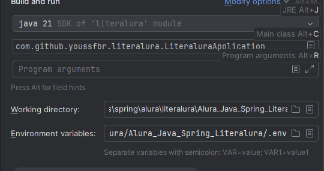

<div align="center">
  <h1 >LiterAlura</h1>

  
</div>


## Introdução

Projeto backend em camadas construído no desafio da 
<a href="https://cursos.alura.com.br/"><strong>Alura Oracle ONE</strong></a> que se trata de uma aplicação com o propósito 
de cadastrar livros e seus respectivos autores.<br> 
Nela é possível:
* Consultar livros na WEB e no banco de dados local (PostgreSQL) ,
* Consultar autores e seus livros ,
* Mostrar os 10 livros mais baixados ... <br>

## Layout 
A interface é simples. Poderia ter criado uma API REST com endpoints ou outro modelo arquitetural, mas o propósito é treinar a lógica.<br> 
Usar estruturas de repetição, lambdas...<br>
Abaixo a interface da aplicação.


## Modelo Conceitual
Interpretei o modelo conceitual como um relacionamento Many to Many (Muitos para Muitos) pois:<br>
* <strong>(1) AUTOR</strong> - pode escrever - <strong>vários (*) LIVROS </strong><br> 
* <strong>(1) LIVRO</strong> - pode ser escrito por - <strong>vários (*) AUTORES</strong> 


## Tecnologias utilizadas
Neste projeto utilizei as seguintes tecnologias:

* <a href="https://www.oracle.com/br/java/"></a>
* <a href="https://spring.io/projects/spring-boot"></a>
* <a href="https://maven.apache.org/"></a>
* <a href="https://hibernate.org/orm/"></a>
* <a href="https://www.postgresql.org/"></a>
* <a href="https://git-scm.com/downloads"></a>
* <a href="https://www.json.org/json-en.html"></a>


## Ferramentas que utilizei (Uso pessoal)
Isso é pessoal. Poderia fazer uso de outras ferramentas. Mas para quem quiser saber, estas foram as ferramentas que usei.
* <a href="https://www.jetbrains.com/pt-br/idea/"></a> 
* <a href="https://dbeaver.io/download/"></a>
* <a href="https://www.postman.com/"></a>
* <a href="https://trello.com/"></a> 
* <a href="https://github.com/youssfbr/"></a>

## Requisitos

* [Java JDK](https://www.oracle.com/br/java/technologies/downloads/#java21) - Estou usando a versão 21 que é Long-term support (LTS).<br /> 
Acredito que versões anteriores como a 16 deva executar , pois usei record e essa funcionalidade surgiu na versão 14 (experimental) e na versão 16
tornou-se definitiva.
* [Git e GitHub](https://git-scm.com/downloads) - Não obrigatório, mas aconselho. Caso não tenha uma conta no GitHub , basta ir no 
<a href="https://github.com/youssfbr/Alura_Java_Spring_Literalura">repositório do projeto e baixá-lo.</a>
* [PostgreSQL](https://www.postgresql.org/download/) - Banco de dados relacional. A aplicação está configurada para 
este banco , sendo possível utilizar qualquer outro banco relacional , mas tem que configurar.
* [Conexão com o banco de dados](https://) - Tem que configurar a conexão com o banco de dados. Pode inserir os dados
no arquivo application-dev.properties diretamente (Não aconselhável) ou usar de boas práticas como criar variáveis de ambiente 
de acordo com seu sistema operacional. Também é possivel criar um arquivo .env e inserir os dados da conexão neste arquivo 
ou na própria IDE , enfim , têm várias formas de fazer essa configuração.
* [Criar a base de dados](https://) Para a aplicação rodar , a base de dados tem que estar criada. No caso do PostgreSQL ,
basta acessar pelo PgAmin ou alguma aplicação que se conecte com o banco de dados como o DBeaver , por exemplo , e ao se 
conectar , criar a base de dados.<br>
Nesta aplicação o nome da base de dados a ser criada é literalura_db , mas é possível alterar. 
* [IntelliJ](https://www.jetbrains.com/pt-br/idea/download/other.html) (Opcional) - Aconselho uma IDE , sem ela terá 
que instalar e configurar o <a href="https://maven.apache.org/download.cgi">MAVEN</a> , 
abrir um terminal , navegar a até a pasta do projeto baixado e executar o comando abaixo: 

```bash
mvn spring-boot:run
```

Se não tiver problemas ele deve baixar todas as dependências do arquivo pom.xml e executar a aplicação.<br>
#### NOTA: Se não tiver configurado o banco e criado a base de dados a aplicação não funcionará.


# Como funciona?
A opção (1) procura na API WEB (Internet) o nome do livro que foi digitado e salva o resultado na base de dados local,
caso encontrado o resultado da busca. <br>
Já nas próximas opções , a consulta é feita no banco de dados local com várias opções de consulta a depender
do número digitado.<br>
Como mostra na imagem abaixo: <br>


## Como executar a aplicação?

De posse de todos os requisitos como o Java JDK , Git , PostgreSQL ...
Vamos iniciar baixando o projeto.
1. Abra um terminal , navegue até o diretório desejado e digite o comando abaixo 
para baixar o projeto para seu computador.

```bash
git clone https://github.com/youssfbr/Alura_Java_Spring_Literalura.git
```

2. Abra uma IDE de sua preferência , no caso estou usando a IntelliJ e a pasta
onde o projeto foi salvo. A IDE deverá baixar todas as dependências que o projeto precisa para rodar.<br>

3. Defina as variaveis de ambiente. Neste caso , crie um arquivo .env na raiz do projeto , junto com o 
arquivo pom.xml e insira os dados relacionados a sua conexão.
 


4. Depois de criado e configurado esse arquivo .env , vá na parte superior à direita , clique na seta apontando para baixo ao lado do nome da aplicação e abrir-se-á um menu.
5. Clique em Edit Configurations ...
 


6. Vai abrir uma modal (janela). 
7. Em Environments variables , clique na pasta onde marquei com azul. 
8. Selecione o arquivo .env .


9. Deverá ficar assim como na imagem abaixo. Só dar OK. Não é necessário reinicializar o sistema operacional. Mais uma vez a IDE ajudando.



10. Crie a base de dados abrindo o pgAdmin , 
11. Em seguida , clique 2 vezes em Servers e coloque a senha. 
12. Clique em Database com o botão direito do mouse. 
13. Em seguida clique em Create > Database. 
14. Coloque o nome da base de dados , no meu caso , literalura_db .


15. Depois de configurada as variáveis de ambiente , agora vamos inicializar o projeto:
16. Clique 2 vezes no arquivo LiteraluraApplication .
17. Localizado em: Path: (Caminho) [Pasta_do_projeto]/[src]/[main]/[java]/com.github.youssfbr.literalura . 
18. Clique em qualquer uma das setas verdes para rodar a aplicação.


<br>
19. Deverá ficar assim:


20. Para testar, como já tenho dados no meu banco de dados vou pesquisar 
por livros em português. 
21. Vou digitar a opção (5)


E como somente tenho 1 livro em português , foi esse resultado que me retornou.


<br>
Dúvidas! Pode entrar em contato nas redes sociais abaixo.


## Contato
 <a href="https://github.com/youssfbr"></a>
 <a href="https://www.linkedin.com/in/alissonyoussf/"></a>
 


## Agradecimento
<a href="https://cursos.alura.com.br/"></a>
<a href="https://www.oracle.com/br/java/"></a>
